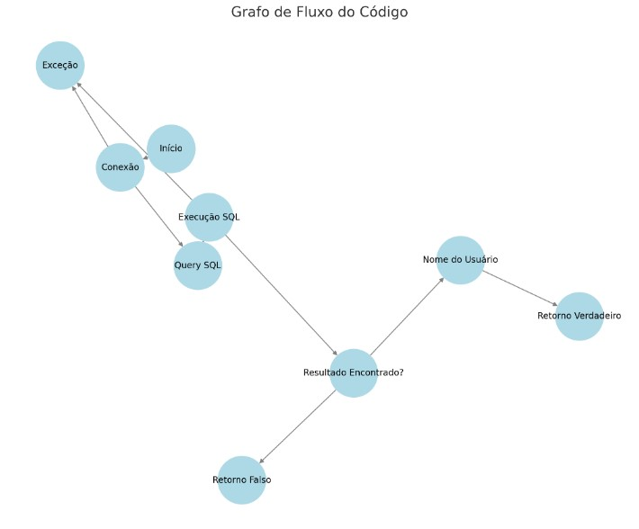

# **TesteCaixaBranca - Sistema de Login**
---

## **Problemas Identificados**

### 1. **Erro no driver JDBC**
- **Descrição:** O código utiliza a classe `"com.mysql.DriverManager"` como driver JDBC, o que está incorreto.
- **Impacto:** Impede a conexão com o banco de dados, tornando o sistema inutilizável.

---

### 2. **SQL Injection**
- **Descrição:** As variáveis `login` e `senha` são conectadas diretamente na query SQL, deixando o sistema vulnerável a ataques de SQL Injection.
- **Impacto:** Possibilidade de invasões ao banco de dados, comprometendo a segurança do sistema.

---

### 3. **Conexão não fechada**
- **Descrição:** A conexão com o banco de dados (`Connection`) não é fechada após o uso, causando vazamento de recursos.
- **Impacto:** Péssimo desempenho e possibilidade de falhas no sistema devido ao esgotamento de conexões.

---

### 4. **Manipulação de exceções**
- **Descrição:** O código ignora exceções ao capturá-las.
- **Impacto:** Dificuldade para diagnosticar erros e manter o sistema.

---

### 5. **Nomes confusos**
- **Descrição:** As variáveis globais `result` e `nome` possuem nomes genéricos, dificultando o entendimento do código.
- **Impacto:** Reduz a legibilidade e aumenta a chance de erros por confusão.

---

### 6. **Possível NullPointerException**
- **Descrição:** Caso a conexão ao banco de dados falhe, a variável `conn` será nula. O código não verifica essa possibilidade antes de utilizá-la.
- **Impacto:** Erros inesperados durante a execução do sistema.

---

#### Descrição dos Nós:
1. **Início:** Entrada no método.
2. **Conexão:** Estabelece a conexão com o banco de dados.
3. **Query SQL:** Cria a instrução SQL para consulta.
4. **Execução SQL:** Executa a query SQL.
5. **Resultado Encontrado?:** Verifica se o resultado foi encontrado.
6. **Nome do Usuário:** Obtém o nome do usuário do banco de dados.
7. **Retorno Verdadeiro:** Retorna verdadeiro caso o usuário seja válido.
8. **Retorno Falso:** Retorna falso caso o usuário não seja encontrado.
9. **Exceção:** Tratamento de exceção para erros.

### Grafo de Fluxo

### Complexidade Ciclomática

A complexidade ciclomática foi calculada para entender o nível de complexidade do código. A fórmula utilizada é:

\[
M = E - N + 2P
\]

- **N**: Número de nó = 9  
- **E**: Número de arestas = 10  
- **P**: Número de componentes conexos = 1  

O cálculo da complexidade foi:

\[
M = 10 - 9 + 2(1) = 3
\]

**Complexidade Ciclomática: 3**

### Caminhos Básicos

Com base na complexidade ciclomática, foram identificados **3 caminhos básicos** no código:

1. **Caminho 1:**
   - Início → Conexão com BD → Criação da Query SQL → Execução da Query SQL → Resultado Encontrado? (Sim) → Nome do Usuário → Retorno Verdadeiro

2. **Caminho 2:**
   - Início → Conexão com BD → Criação da Query SQL → Execução da Query SQL → Resultado Encontrado? (Não) → Retorno Falso

3. **Caminho 3:**
   - Início → Exceção (Caso ocorra um erro na conexão ou execução da query)

